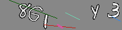
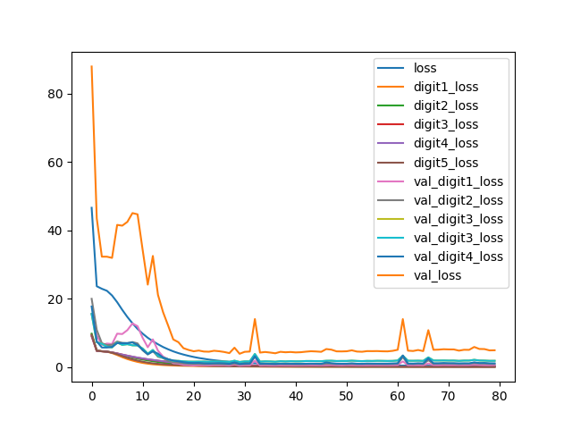

# image_project

Convolutional neural network to solve captcha

to run projects:

1. run functions for generate images with captha:
- captcha_generator() from `donwload` will generate captcha like this:

- or download_mnist_dataset() from `download_emnist.py`, then start prepare_image_multi_objects.py

2. train cnn on dataset with images - run classifier_cnn.py
Loss throw 80 epochs, bath size: 300, optimizer: adam, loss function - categorical_crossentropy

## Metrics on train and validation data

| Outputs  | Precision validation| Recall validation| F1 validation | Precision train| Recall train| F1 train |
| ------------- | ------------- | ------------- |------------- |------------- | ------------- |------------- |
| 1st Dense| 0.868 | 0.891 |0.879 | 0.986| 0.987 | 0.986 |
| 2nd Dense| 0.808 | 0.816 |0.811 |0.970| 0.975 | 0.972|
| 3rd Dense| 0.75 |  0.73 | 0.739 | 0.904 | 0.907 | 0.905 |
| 4th Dense| 0.847 | 0.833 | 0.839 | 0.965 | 0.965 | 0.965 |
| 5th Dense| 0.935 | 0.919 | 0.926 | 0.980 | 0.979 | 0.979 |